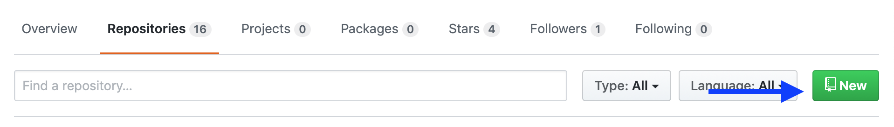
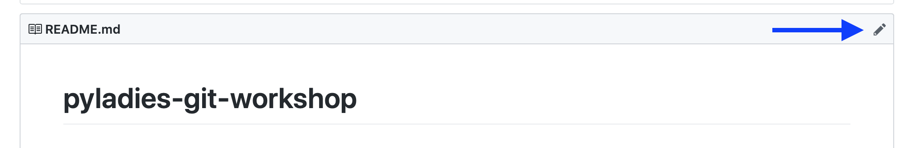
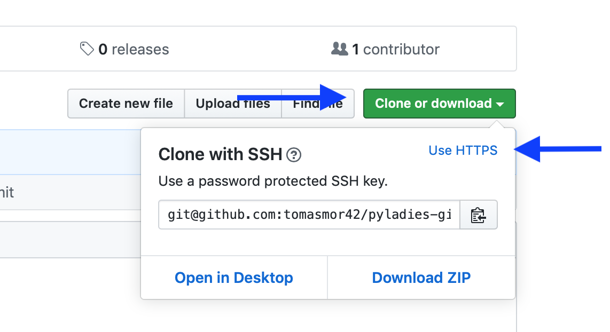

## Step 2: Create repo

## Create repository with GitHub

1. Go to your github account.
2. Switch to tab Repositories.

<p>

</p>

3. Click `New` button.


4. Create a public repository with name `pyladies-git-workshop`. Use "Initialize with README" option.
Now you have your git repo! You can also update existing README from the browser using icon:

<p>

</p>

## Clone repository to your local machine

Now we want to create a local copy of this repo.

1. Go to your repo page.
2. Find a button `Clone or download`.

<p>

</p>
Copy the repo address with the button on a screenshot.


3. Go to your workspace folder in a terminal (shell) and clone this repo with command:
`git clone git@github.com:{your_github_name}/pyladies-git-workshop.git`
You should see
```
git clone git@github.com:tomasmor42/pyladies-git-workshop.git
Cloning into 'pyladies-git-workshop'...
remote: Enumerating objects: 3, done.
remote: Counting objects: 100% (3/3), done.
remote: Total 3 (delta 0), reused 0 (delta 0), pack-reused 0
```
4. You can check that folder with name `pyladies-git-workshop` appeared in your working directory.
5. Go to the repo folder with `cd pyladies-git-workshop`
