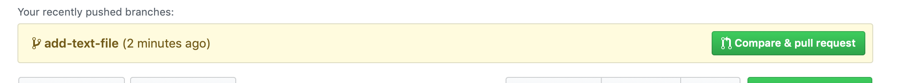

## Create feature branch and update repo

Feature branches are important for a git flow: they help to make history cleaner and commits safer.

1. In terminal go to the folder with a project. Update repository with `git pull`.
If there is any conflicts with versions, you'll have to resolve a merge conflicts manually. 
This command will take all updates from the remote repo. It's important to do it, to be up to date.
2. Now our master branch is up to date. We can create a new local branch with name `add-text-file`:

```
git checkout -b add-text-file
```
Checkout command actually means switch between branches. But with key `-b` it will create a new branch.
Check that branch was created successfully:
```
git branch
```
You should see something like:
```
git branch
* add-text-file
 master
```
3. Create a new file in the repo folder `hello_world.py` with text editor (or with command `touch hello_world.py`). Check the status of repository with command `git status`
You should see that git sees this file, but it's not tracked:
```
git status
On branch add-text-file
Untracked files:
  (use "git add <file>..." to include in what will be committed)

	hello_world.py

nothing added to commit but untracked files present (use "git add" to track)
```
4. Add untracked file with `git add hello_world.py`. Check that now it's added with `git status`.
What you should see :
```
git status
On branch add-text-file
Changes to be committed:
  (use "git reset HEAD <file>..." to unstage)

	new file:   hello_world.py

```
It means, that we just created a file, make git aware of this file and prepared it for a commit.

5. So far we have an empty file, but in general we want to put some code there. Open the file with your favourite text editor and add some code there and save the file.
Git doesn't add changes of the file after it was staged.We can check it with `git status`:
```
git status
On branch add-text-file
Changes to be committed:
  (use "git reset HEAD <file>..." to unstage)

	new file:   hello_world.py

Changes not staged for commit:
  (use "git add <file>..." to update what will be committed)
  (use "git checkout -- <file>..." to discard changes in working directory)

	modified:   hello_world.py
  ```

 so if we want to add our latest changes to a staging, we need to add file again.

 6. Create a commit. In commit pack all staged changes and create a check-point we can roll back later.
 To commit you have to run: `git commit` after you type this command text editor will open, and you have to type commit message. You have to choose wisely, commit message will be visible in commit. It may content several words. If you don't need also to see an info about the commit, you just want to commit with a message, you can use the command `git commit -m 'Add hello_world file'`

 7. Now we created a commit, so far it's a local commit. Let's push it to a remote repo.
 We can do it with `git push` command.
 It's a first commit for this remote branch, so we have to create it altogether with a push.
```
git push --set-upstream origin add-text-file
```
Here `origin` means the link to our repository.

8. Go to your GitHub account. You should see a message that new branch is detected:

<p>

</p>

 9. Create a Pull Request. In the web interface you can see difference between original file and updated, also you can see the list of updated files.

 10. (Optional) You can add someone as a collaborator for your project. At the repository page go to Settings -> Collaborators -> add someone you want to have as a collaborator for your project. After that you will be able to add this user as a reviewer for your Pull request.
