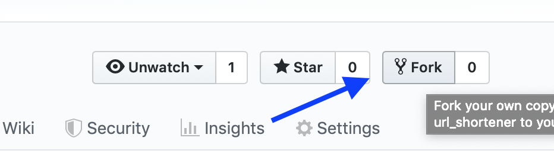
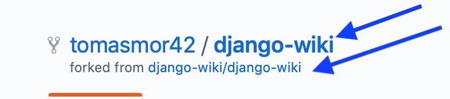

## Create a fork a open PR in a different repository.

If you're going to contribute in an open source project in GitHub most likely you have to follow this flow.

1. Go to page of the project you're going to contribute. I would suggest to choose project one of yours workshop-mates.  


<p>

</p>


Click on `Fork` button and create a fork of original repo in your own account.

<p>

</p>

In your github account you'll see it as a fork from original repo.

2. Clone your repository to the local machine. Go to a folder with a cloned repo.
First we can check what remote addresses are pointing to our repo:
```
git remote -v
origin	git@github.com:tomasmor42/GitHub-beginner-nov2019.git (fetch)
origin	git@github.com:tomasmor42/GitHub-beginner-nov2019.git (push)
```
We have to set up pointer to a original repository so we would be able to sync them.
```
git remote add upstream git@github.com:pyladiesams/GitHub-beginner-nov2019.git
```
Where after upstream is address of original repository. Let's check that upstream was successfully added:
```
Olgas-MacBook-Pro:pyladies-git-workshop olgas$ git remote -v
origin	git@github.com:tomasmor42/pyladies-git-workshop.git (fetch)
origin	git@github.com:tomasmor42/pyladies-git-workshop.git (push)
upstream	git@github.com:pyladiesams/GitHub-beginner-nov2019.git (fetch)
upstream	git@github.com:pyladiesams/GitHub-beginner-nov2019.git (push)
```
It will help us syncronize forked repo and original repo. If there is any changes in original repo we will be able to pull them with commands:
```
git fetch upstream
git checkout master
git merge upstream/master
```
3. Change a content of a repo and push your commit to a branch of forked repo.
Now you can create a PR into original repo.
Go to GitHub page of original repository and click on `Compare and create pull request` button.

Wait for the comments in review!
